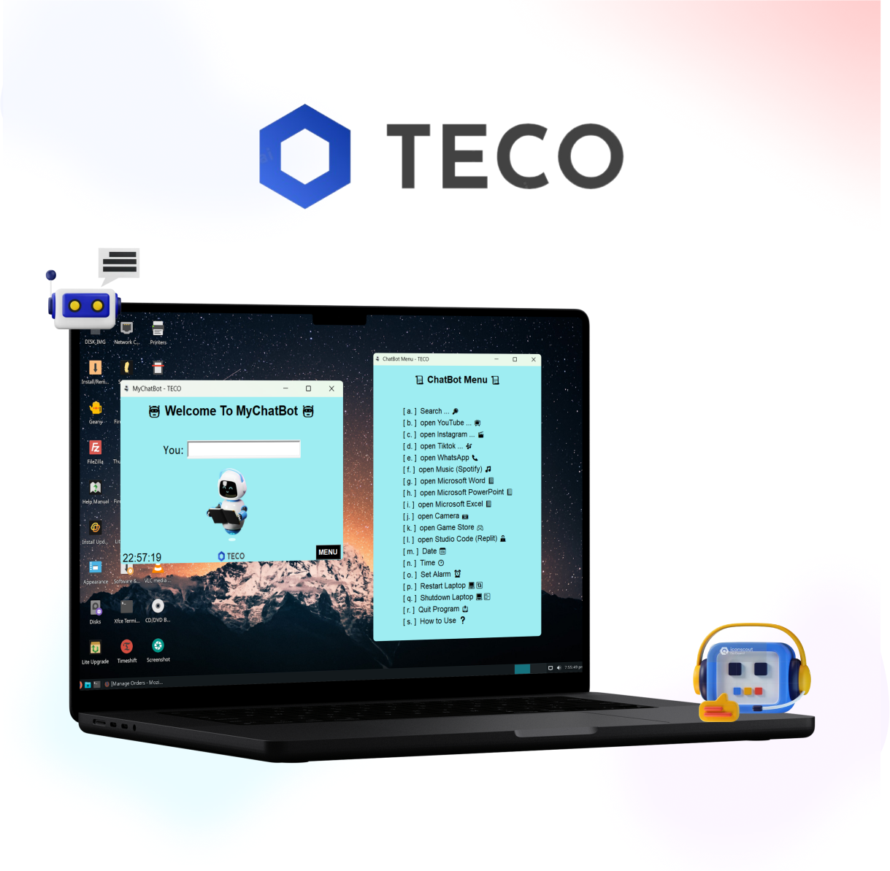

# TECO: Simple App Access

TECO adalah aplikasi yang dirancang untuk membuka aplikasi secara efisien menggunakan perintah yang telah disediakan. Dengan antarmuka yang sederhana dan responsif, TECO membantu meningkatkan produktivitas dalam mengelola berbagai aplikasi.

🚀 **Fitur Utama:**
- Membuka aplikasi dengan cepat menggunakan perintah khusus.
- Antarmuka sederhana yang mudah digunakan.

🔮 **Rencana Pengembangan:**
- Integrasi dengan AI untuk pengalaman penggunaan yang lebih cerdas.
- Penambahan fitur input data baru untuk shortcut aplikasi lainnya.

Jadikan pengalaman menggunakan aplikasi lebih cepat dan efisien dengan **TECO**!
